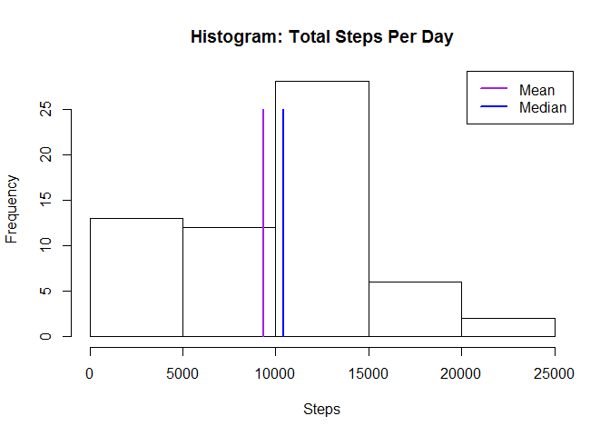
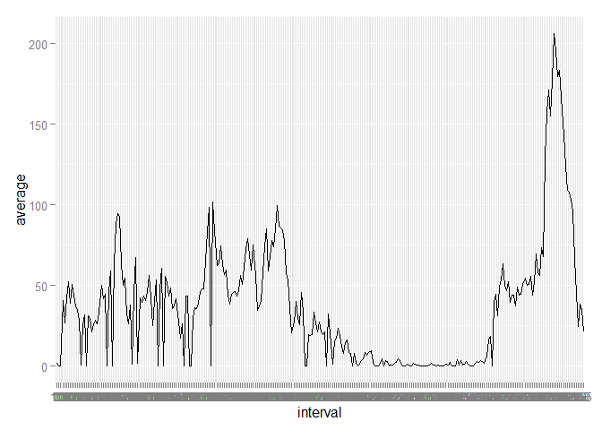
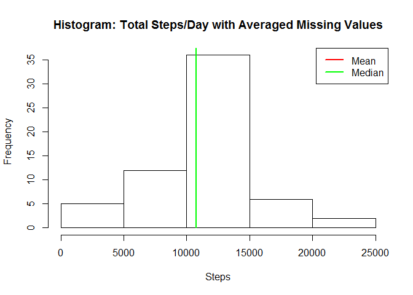
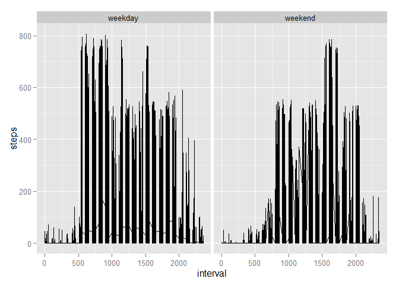

# Reproducible Research: Peer Assessment 1

## Loading and preprocessing the data

The Activity monitoring dataset for this assignment can be found on the course web site URL, 
<https://d396qusza40orc.cloudfront.net/repdata%2Fdata%2Factivity.zip> but is available locally when the github
repo is cloned into a local git repo.

The variables included in this dataset are:
-	**steps**: Number of steps taking in a 5-minute interval (missing values are coded as NA)
-	**date**: The date on which the measurement was taken in YYYY-MM-DD format
-	**interval**: Identifier for the 5-minute interval in which measurement was taken

Within the activity.zip file, the dataset is stored in a comma-separated-value (CSV) file; there are a total of 17,568 observations in this dataset. These remain in the zip file rather than being unzipped and stored in the local filesystem.

Shown below in the chunk **pulldata** is the code needed to load the data. The data is unzipped and stored in the variable *activityData*.


```r
activityData<-read.table(unz("activity.zip", "activity.csv"), header=T, quote="\"", sep=",")
```

In the **processdata** chunk, the data is processed/transformed(if necessary) into a format suitable for analysis. The data calculated is for use in a later part - code to remove NA values in steps and replace with the average by interval.


```r
avgSteps<-as.data.frame(tapply(activityData$steps,activityData$interval, mean, na.rm=TRUE))
avgSteps <- cbind(row.names(avgSteps),avgSteps)
row.names(avgSteps) <- c(1:nrow(avgSteps))
names(avgSteps) <- c("interval", "average")

replaceNA <- function(df, avgs, index) {
  if(is.na(df[i,]$steps)) {
    for(j in 1:nrow(avgs)) {
        if(df[index,]$interval == avgSteps[j,]$interval) {
            return(avgSteps[j,]$average)
        }
    }
  }
}
```

## What is mean total number of steps taken per day?
For this part of the assignment, the missing values in the dataset are ignored.
Code for the next parts is in the **totalsteps** chunk:
1.	Calculate the total number of steps taken per day
2.	Make a histogram of the total number of steps taken each day
3.	Calculate and report the mean and median of the total number of steps taken per day


```r
totalSteps<-as.data.frame(tapply(activityData$steps,activityData$date,sum, na.rm=TRUE))
dates<-row.names(totalSteps)
totalSteps<-cbind(dates,totalSteps)
row.names(totalSteps) <- c(1:length(dates))
names(totalSteps) <- c("dates", "steps")

meanSteps <- mean(totalSteps$steps)
medianSteps <- median(totalSteps$steps)
maxSteps <- max(totalSteps$steps)

hist(totalSteps$steps,main="Histogram: Total Steps Per Day",xlab="Steps")
lines(c(meanSteps,meanSteps),c(0,25),lwd=2,col="purple")
lines(c(medianSteps,medianSteps),c(0,25),lwd=2,col="blue")
legend("topright",pch = " ", lwd=2, lty=1,merge=FALSE, col=c("purple", "blue"), legend = c("Mean","Median"))
```

 
### Mean and Median:
The *mean* of the total number of steps taken per day is 9354.2295082 steps.
The *median* of the total number of steps taken per day is 10395 steps.

## What is the average daily activity pattern?
This section of code, under the chunk **avgdailyactivity**, accomplishes the following:

1.	Make a time series plot (i.e. type = "l") of the 5-minute interval (x-axis) and the average number of steps taken, averaged across all days (y-axis)
2.	Which 5-minute interval, on average across all the days in the dataset, contains the maximum number of steps?


```r
library(ggplot2)
tsAvg <- as.ts(avgSteps)
ggplot(avgSteps,aes(x=interval,y=average, group=1)) + geom_line()
```

 

```r
maxAvg<-avgSteps[which.max(avgSteps$average),]
maxInterval<-as.character(maxAvg$interval)
```
###The 5-minute interval that contains the maximum number of steps on average is 835.

## Imputing missing values
Note that there are a number of days/intervals where there are missing values (coded as NA). The presence of missing days may introduce bias into some calculations or summaries of the data.

This section, under the chunk **countmissingvalues**, calculates and reports the total number of missing values in the dataset (i.e. the total number of rows with NAs.)


```r
missingValues <- sum(is.na(activityData$steps))
```

### The total number of missing values in the data set is 2304.

This section, under the chunk **imputemissingvalues**, creates a new dataset, *filledDataSet*, where the missing values in the dataset are replaced with the mean for the corresponding 5-minute interval, etc. and displays a histogram of the total number of steps taken each day; it also calculates the mean and median total number of steps taken per day. 


```r
filledDataSet <- activityData
for(i in 1:nrow(activityData)) {
  if(is.na(activityData[i,]$steps)) {
    filledDataSet[i,1]<- replaceNA(activityData, avgSteps, i)
  }
  
}

totalFilled<-as.data.frame(tapply(filledDataSet$steps,filledDataSet$date,sum, na.rm=TRUE))
dates<-row.names(totalFilled)
totalFilled<-cbind(dates,totalFilled)
row.names(totalFilled) <- c(1:length(dates))
names(totalFilled) <- c("dates","steps")
meanFilled <- mean(totalFilled$steps)
medianFilled <- median(totalFilled$steps)
maxFilled <- max(totalFilled$steps)

hist(totalFilled$steps,xlab="Steps",main="Histogram: Total Steps/Day with Averaged Missing Values")
lines(c(meanFilled,meanFilled),c(0,maxFilled),lwd=2,col="red")
lines(c(medianFilled,medianFilled),c(0,maxFilled),lwd=2,col="green")
legend("topright",pch = " ", lwd=2, lty=1,merge=FALSE, col=c("red", "green"), legend = c("Mean","Median"))
```

 

```r
meanText <- "The mean did not change."
if(meanSteps > meanFilled) {
    lower <- meanSteps - meanFilled
    meanText <- cat("The mean (average) has been lowered by ", lower, ".")
} else if(meanSteps < meanFilled) {
    higher <- meanFilled - meanSteps
    meanText <- cat("The mean (average) has been raised by ",higher,".")
}
```

```
## The mean (average) has been raised by  1411.959 .
```

```r
medianText <- "The median did not change."
if(medianSteps > medianFilled) {
    lower <- medianSteps - medianFilled
    medianText <- cat("The median (average) has been lowered by ", lower, ".")
} else if(medianSteps < medianFilled) {
    higher <- medianFilled - medianSteps
    medianText <- cat("The median (average) has been raised by ", higher, ".")
}
```

```
## The median (average) has been raised by  371.1887 .
```
### Mean and Median of filled dataset:
The *mean* of the filled total number of steps taken per day is 1.0766189\times 10^{4} steps.
The *median* of the filled total number of steps taken per day is 1.0766189\times 10^{4} steps.

Do these values differ from the estimates from the first part of the assignment? 
What is the impact of imputing missing data on the estimates of the total daily number of steps? 


## Are there differences in activity patterns between weekdays and weekends?
1.	Create a new factor variable in the dataset with two levels - "weekday" and "weekend" indicating whether a given date is a weekday or weekend day.
2.	Make a panel plot containing a time series plot (i.e. type = "l") of the 5-minute interval (x-axis) and the average number of steps taken, averaged across all weekday days or weekend days (y-axis). See the README file in the GitHub repository to see an example of what this plot should look like using simulated data.

```r
filledDataSet$day<-weekdays(as.Date(filledDataSet$date))
filledDataSet[filledDataSet=="Monday" | filledDataSet == "Tuesday" | filledDataSet == "Wednesday"]<-"weekday"
filledDataSet[filledDataSet=="Thursday" | filledDataSet == "Friday"] <- "weekday"
filledDataSet[filledDataSet=="Sunday" | filledDataSet == "Saturday"] <- "weekend"

avgStepsWk<-as.data.frame(tapply(filledDataSet$steps,filledDataSet$day, mean, na.rm=TRUE))
par(mfrow=c(1,2))
qplot(interval, steps, data=filledDataSet, facets =  . ~ day, geom="line" )
```

 


```
## ##------ Sun Dec 20 16:01:44 2015 ------##
```

###This Rmd was knitted and executed ##------ Sun Dec 20 16:01:44 2015 ------##. 
